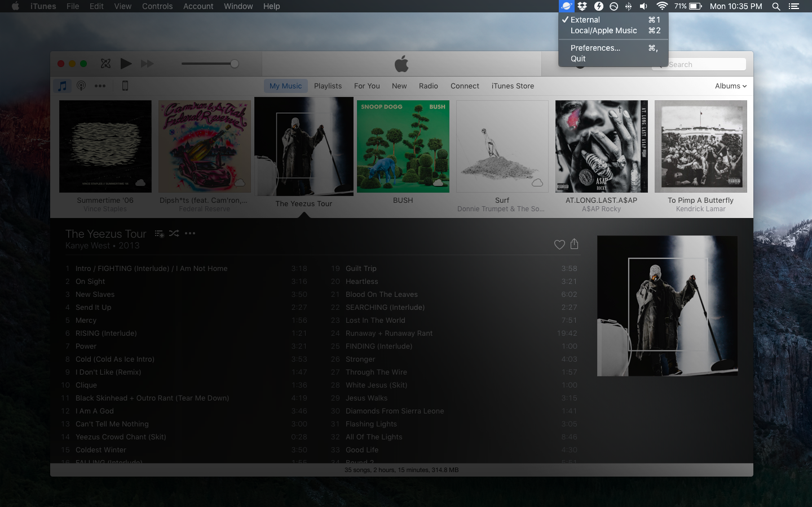

# Neptune

Tune up your iTunes setup!
- Quickly switch iTunes libraries with your Mac menu bar

*Coming soon:*
- Sync your iPhone with multiple iTunes libraries
- Simple, pause-able iTunes backups

### What does it actually do?

A screenshot says a thousand words:



### How do I use it?

[Download the latest release](https://github.com/randallm/neptune/releases) for OS X Yosemite/El Capitan on the Releases page above.

If you don't already have multiple libraries set up, you can create new libraries by holding down ⌥ while you open iTunes. Then you can add them to Neptune!

### I'm a developer. Can I help contribute?

Sure thing! Neptune is

- built with [Electron](http://electron.atom.io/)
- MIT Licensed — peep the full text in [/LICENSE]()
- accepting pull requests

To get started, fork/clone this repo and...

```sh
$ npm install
$ grunt
```

### Why is it named *Neptune*?

Possible reasons:

- it's *out of this world* :earth_africa:
- it's dedicated to the [best hip-hop production duo of all time](https://en.wikipedia.org/wiki/The_Neptunes)
- all the other good names were taken

## Attributions

I claim no affiliation with Apple Inc. "Apple", "Mac", "iPhone", "Mac OS X" and "iTunes" are registered trademarks of Apple Inc.

[Planet](https://thenounproject.com/term/planet/108370/) icon by Creative Stall from the Noun Project
